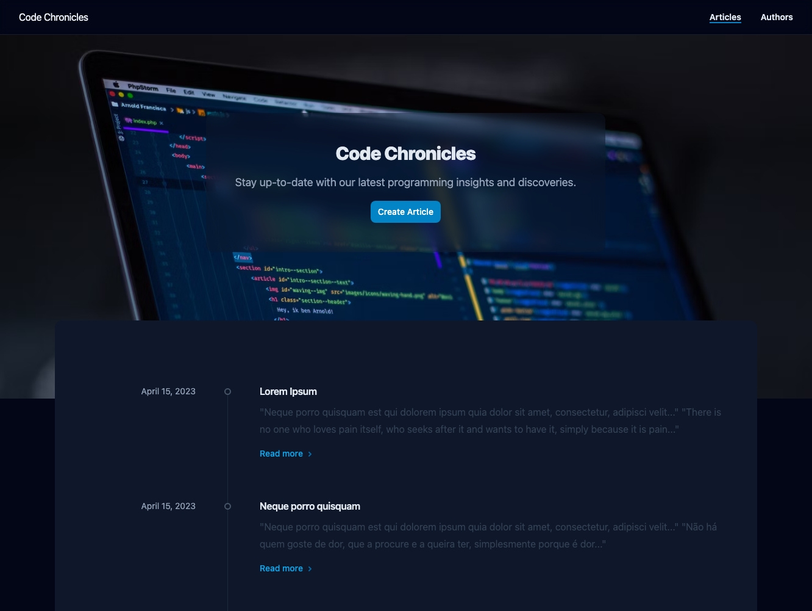
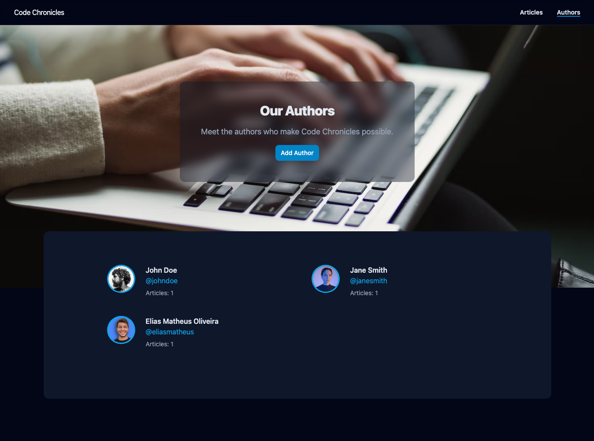
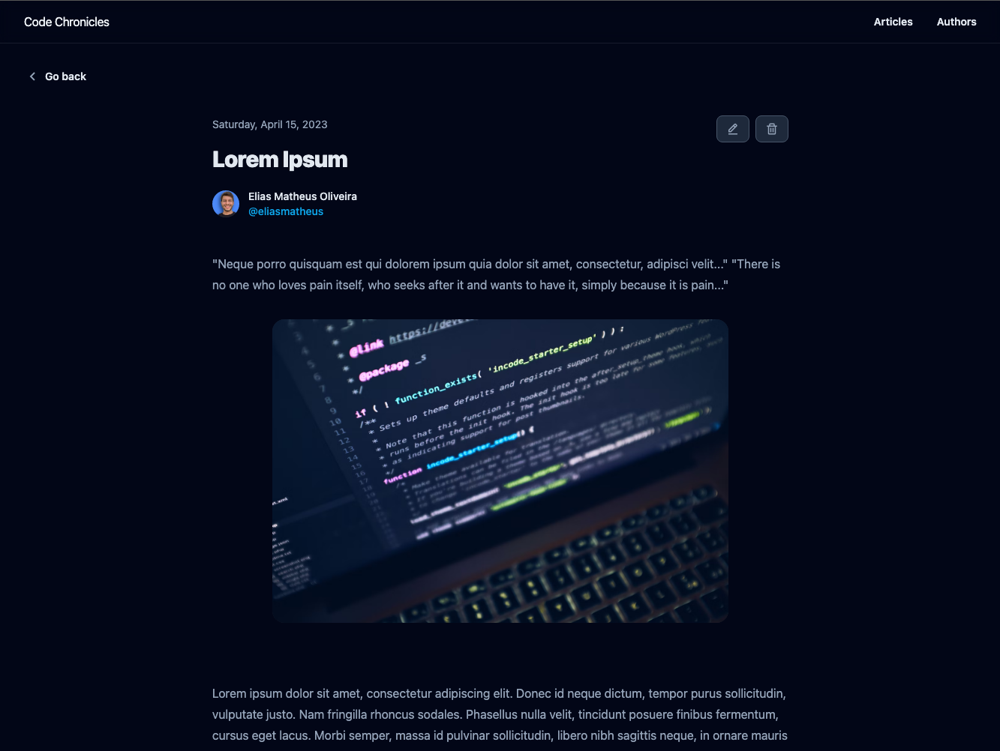
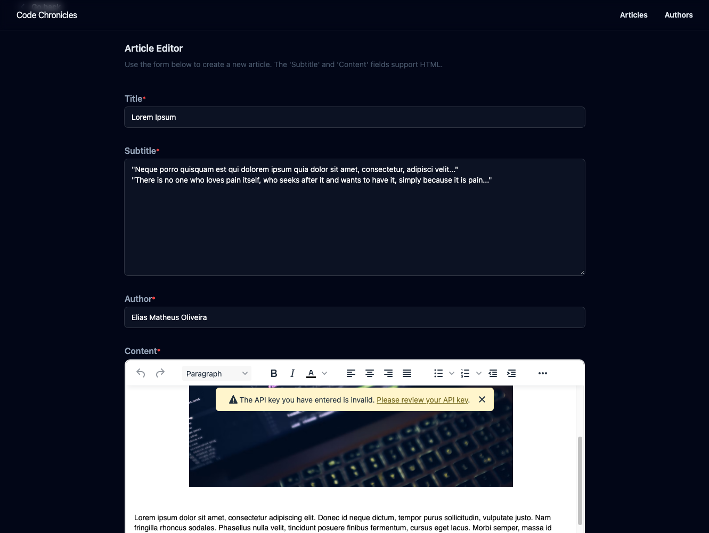

# Code Chronicles Blog


Este projeto da uma interface de usuário desenvolvida com React e Tailwind para a API de um blog desenvolvido em
Flask para a disciplina de **Desenvolvimento Full Stack Básico** do programa de pós-graduação em Desenvolvimento
Full Stack da [PUC-Rio](https://www.puc-rio.br/index.html).

## Screenshots

<div align="center">
  
  
</div>

<div style="clear: both; margin-bottom: 28px;"></div>

<div align="center" style="clear: both">
  
  
</div>

<div style="clear: both"></div>

---

## Technologias

- [React](https://reactjs.org/)
- [Vite](https://vitejs.dev/)
- [Tailwind](https://tailwindcss.com/)
- [Axios](https://axios-http.com/ptbr/docs/intro)
- [React Router Dom](https://reactrouter.com/web/guides/quick-start)
- [React Icons](https://react-icons.github.io/react-icons/)
- [TinyMCE](https://www.tiny.cloud/docs/)
- [React Hook Form](https://react-hook-form.com/)
- [Radix UI](https://www.radix-ui.com/docs/primitives/overview/introduction)
- [Date-fns](https://date-fns.org/)

## Como executar

### Pré-requisitos

Antes de começar, você vai precisar ter instalado em sua máquina as seguintes ferramentas:
[Git](https://git-scm.com), [Node.js](https://nodejs.org/en/).
Além disto é bom ter um editor para trabalhar com o código como [VSCode](https://code.visualstudio.com/)

### Rodando a aplicação

```bash
# Clone este repositório
$ git clone https://github.com/eliasmatheus/simple-flask-blog-web

# Acesse a pasta do projeto no terminal/cmd
$ cd simple-flask-blog-web

# Instale as dependências
$ npm install

# Execute a aplicação em modo de desenvolvimento
$ npm run dev

# A aplicação inciará na porta:5173 - acesse <http://127.0.0.1:5173/>
```

Abra o [http://127.0.0.1:5173/](http://127.0.0.1:5173/) para acessar a aplicação.

### Rodando o backend

Para rodar o servidor, acesse o repositório do [backend](https://github.com/eliasmatheus/simple-flask-blog) e siga as instruções.
